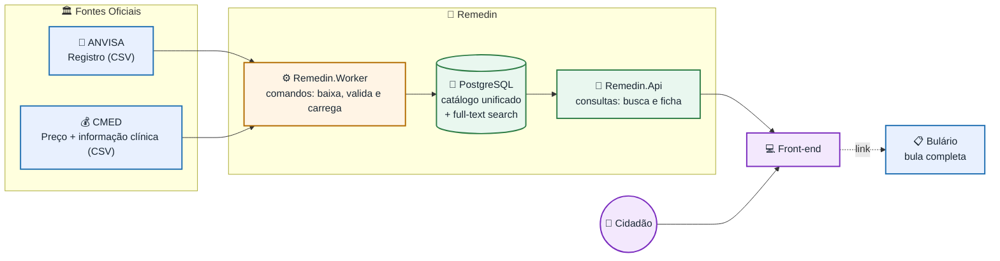

# 💊 Remedin

> Plataforma web gratuita para consultar informações de medicamentos aprovados no Brasil — reunindo **registro**, **bula** e **preço máximo legal** num só lugar.


---

## 📖 Sobre o projeto

O **Remedin** é uma plataforma gratuita e de caráter social cujo objetivo é **democratizar o acesso à informação sobre medicamentos** para o cidadão comum — com atenção especial a idosos e pessoas de baixa renda, que mais sofrem com a falta de informação clara e com cobranças acima do preço legal.

A partir de **fontes públicas oficiais**, o cidadão pode pesquisar um medicamento e descobrir:

- ✅ Para que ele serve e se **exige receita**;
- 💰 Qual o **preço máximo legal** que a farmácia pode cobrar (PMC);
- 🔎 Alternativas por **princípio ativo** (genéricos mais baratos).

> ⚠️ **Aviso:** o Remedin é uma ferramenta **informativa** e **não substitui** a orientação de médico ou farmacêutico.

---

## 🏛️ Fontes de dados oficiais

| Fonte | Órgão | Conteúdo | Formato |
|-------|-------|----------|---------|
| [Medicamentos Registrados no Brasil](https://dados.gov.br/dataset/medicamentos-registrados-no-brasil) | ANVISA (Datavisa) | Registro e situação do medicamento | CSV |
| [Preço de Medicamentos — Consumidor](https://dados.gov.br/dados/conjuntos-dados/preco-de-medicamentos-no-brasil-consumidor) | ANVISA / CMED | Preço Fábrica (PF) e Preço Máximo ao Consumidor (PMC) | CSV |
| [Bulário Eletrônico](https://www.gov.br/anvisa/pt-br/sistemas/bulario-eletronico) | ANVISA | Bula completa, linkada na ficha | PDF, um por produto |

> Os dados são públicos e abertos. O Remedin **cita a fonte** e exibe a informação como derivada dos dados oficiais, sem se apresentar como fonte oficial.

📊 A análise de estrutura, volume e qualidade de cada base está em [`docs/`](docs/).

---

## 🏗️ Arquitetura

O núcleo técnico do projeto é a **engenharia de dados**: pipelines de ETL coletam, limpam, normalizam e **cruzam** bases públicas de formatos diferentes, unificando-as num catálogo consultável.

🔑 O cruzamento entre **registro** e **preço** é feito pelo número de registro da ANVISA, que aparece nos 9 primeiros dígitos do código de 13 dígitos usado pela CMED — com **99,96% de cobertura** das linhas de preço ([análise completa](docs/analise-dados-cmed.md)).



Diagramas C4 detalhados em [`docs/arquitetura-c4.md`](docs/arquitetura-c4.md).

### Clean Architecture, DDD e CQRS

Quatro camadas com a regra de dependência apontando para dentro: `Domain` não referencia nada, `Application` referencia `Domain`, `Infrastructure` implementa as interfaces declaradas em `Application`, e os pontos de entrada compõem tudo. A regra é **verificada por teste de arquitetura** — o build quebra se `Domain` referenciar infraestrutura.

CQRS na camada de aplicação: os comandos (`ImportRegistrySnapshot`, `ImportPriceList`) vêm do agendador e passam pelo agregado validando invariantes; as consultas (`SearchMedicines`, `GetMedicineDetail`) leem uma projeção desnormalizada com `tsvector`, sem passar pelo domínio ([ADR 0004](docs/adr/0004-clean-architecture-e-cqrs.md)).

### Por que duas unidades e não microsserviços

As fontes carregam em segundos e mudam uma vez por mês. Serviços de ingestão separados escreveriam nas mesmas tabelas do mesmo PostgreSQL, o que anula o deploy independente e deixa só o custo de operar processos separados ([ADR 0003](docs/adr/0003-monolito-modular.md)).

A separação entre API e worker já entrega o isolamento que importa: a carga roda agendada, sob demanda quando preciso, e uma falha nela não afeta a busca porque é outro processo.

---

## 🛠️ Stack

| Camada | Tecnologia |
|--------|-----------|
| **Back-end** | .NET (C#) com Clean Architecture, DDD e CQRS |
| **Banco de dados** | PostgreSQL (com full-text search) |
| **Front-end** | React |
| **Ingestão** | Pipelines de ETL |
| **Infra / Processo** | GitHub, GitHub Projects, CI, deploy em servidor próprio |

---

## 📂 Estrutura do repositório

```
remedin/
├── docs/               # Análises das fontes, ADRs, diagramas C4
├── src/                # Código-fonte (.NET e front-end)
├── tests/              # Testes de domínio e de arquitetura
├── data/               # Amostras dos dados da ANVISA/CMED
├── scripts/            # Exploração e perfil das bases
├── .github/            # Issue templates
└── docker-compose.yml  # PostgreSQL local
```

---

## ▶️ Rodando localmente

Requisitos: .NET 9 e Docker.

```bash
docker compose up -d
dotnet tool install --global dotnet-ef --version "9.0.*"
dotnet ef database update -p src/Remedin.Infrastructure -s src/Remedin.Api
dotnet run --project src/Remedin.Api
```

O banco sobe na porta **5433** do host, e não na 5432, para não disputar a
porta com um PostgreSQL instalado na máquina. Esse conflito se manifesta como
`role "remedin" does not exist`, que aponta para o lugar errado: a conexão foi
parar no PostgreSQL local, que não conhece esse usuário.

As extensões `unaccent` e `pg_trgm` são criadas pela migration, e não por
script de inicialização do container, para que o mesmo schema valha em
desenvolvimento e em produção.

Verificação: `curl http://localhost:<porta>/health` responde `Healthy`, e
responde 503 se o banco estiver fora do ar.

```bash
dotnet test    # testes de domínio e de arquitetura
```

---

## 📜 Licença

Distribuído sob a licença **MIT**. Veja o arquivo [`LICENSE`](LICENSE) para mais informações.

Os dados de medicamentos pertencem à **ANVISA/CMED** e são utilizados sob as licenças de dados abertos das respectivas fontes, com a devida atribuição.

---

<p align="center"><i>Remedin — informação de medicamentos, acessível a todos.</i></p>
