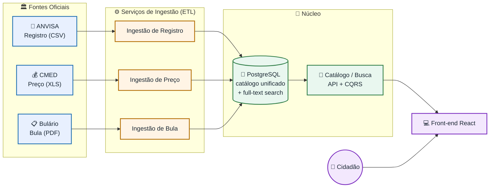

# 💊 Remedin

> Plataforma web gratuita para consultar informações de medicamentos aprovados no Brasil — reunindo **registro**, **bula** e **preço máximo legal** num só lugar.


---

## 📖 Sobre o projeto

O **Remedin** é uma plataforma gratuita e de caráter social cujo objetivo é **democratizar o acesso à informação sobre medicamentos** para o cidadão comum — com atenção especial a idosos e pessoas de baixa renda, que mais sofrem com a falta de informação clara e com cobranças acima do preço legal.

A partir de **fontes públicas oficiais**, o cidadão pode pesquisar um medicamento e descobrir:

- ✅ Para que ele serve e se **exige receita**;
- 💰 Qual o **preço máximo legal** que a farmácia pode cobrar (PMC);
- 🔎 Alternativas por **princípio ativo** (genéricos mais baratos).

> ⚠️ **Aviso:** o Remedin é uma ferramenta **informativa** e **não substitui** a orientação de médico ou farmacêutico.

---

## 🏛️ Fontes de dados oficiais

| Fonte | Órgão | Conteúdo | Formato |
|-------|-------|----------|---------|
| [Medicamentos Registrados no Brasil](https://dados.gov.br/dataset/medicamentos-registrados-no-brasil) | ANVISA (Datavisa) | Registro e situação do medicamento | CSV |
| [Bulário Eletrônico](https://www.gov.br/anvisa/pt-br/sistemas/bulario-eletronico) | ANVISA | Indicações, tarja, exigência de receita | PDF |
| [Lista de Preços — CMED](https://www.gov.br/anvisa/pt-br/assuntos/medicamentos/cmed/precos) | ANVISA / CMED | Preço Máximo ao Consumidor (PMC) | XLS |

> Os dados são públicos e abertos. O Remedin **cita a fonte** e exibe a informação como derivada dos dados oficiais, sem se apresentar como fonte oficial.

---

## 🏗️ Arquitetura

O núcleo técnico do projeto é a **engenharia de dados**: pipelines de ETL coletam, limpam, normalizam e **cruzam** bases públicas de formatos diferentes, unificando-as num catálogo consultável.



### Por que microsserviços e não um monólito?

A separação segue as **fronteiras de domínio** e as diferentes **cadências de atualização** de cada fonte:

- 💰 **Preço (CMED)** muda mensalmente;
- 📄 **Registro (ANVISA)** muda de forma contínua e irregular;
- 📋 **Bula** muda quando cada fabricante peticiona.

Um monólito atenderia à função, mas acoplaria processos que têm razões independentes para **mudar, escalar e falhar**. Separar a ingestão (batch, pesada) da busca (online, de baixa latência) também isola a carga — um reprocessamento pesado não degrada as consultas do usuário.

### Por que CQRS?

A leitura (busca) é **frequente e pesada** e se beneficia de modelos de leitura otimizados; a escrita vem **apenas** dos pipelines de ETL. Separar os dois é exatamente o cenário que justifica CQRS.

---

## 🛠️ Stack

| Camada | Tecnologia |
|--------|-----------|
| **Back-end** | .NET (C#) com DDD e CQRS |
| **Banco de dados** | PostgreSQL (com full-text search) |
| **Front-end** | React |
| **Ingestão** | Pipelines de ETL |
| **Infra / Processo** | GitHub, GitHub Projects, CI, deploy em servidor próprio |

---

## 📂 Estrutura do repositório

```
remedin/
├── docs/          # Diagramas, decisões de arquitetura (ADRs), protótipos
├── src/           # Código-fonte (serviços .NET, front-end React)
├── data/          # Amostras dos dados da ANVISA/CMED
├── .github/       # Issue templates e workflows de CI
└── README.md
```

---

## 📜 Licença

Distribuído sob a licença **MIT**. Veja o arquivo [`LICENSE`](LICENSE) para mais informações.

Os dados de medicamentos pertencem à **ANVISA/CMED** e são utilizados sob as licenças de dados abertos das respectivas fontes, com a devida atribuição.

---

<p align="center"><i>Remedin — informação de medicamentos, acessível a todos.</i></p>
