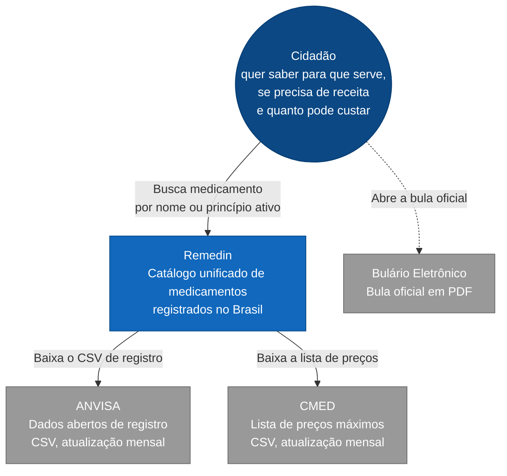
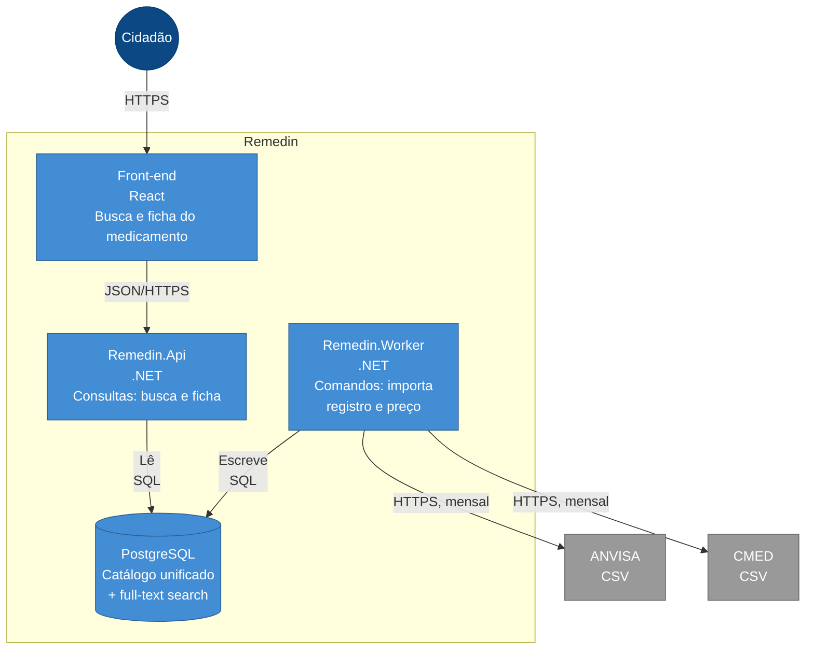

# Arquitetura — diagramas C4

O modelo C4 descreve um sistema em níveis de zoom. Aqui estão os dois primeiros:

- **Nível 1, Contexto:** o Remedin visto de fora, e com quem ele conversa.
- **Nível 2, Container:** o que existe dentro do Remedin e como as partes se comunicam.

Os níveis 3 e 4 entram quando houver código.

## Nível 1 — Contexto



O Remedin ingere duas fontes: registro diz que o medicamento existe, preço diz quanto ele pode custar e traz a informação clínica ([ADR 0005](adr/0005-fonte-da-informacao-clinica.md)). A ficha leva o usuário ao Bulário para ler a bula completa, sem baixá-la.

O Remedin não recebe dado de ninguém além das fontes oficiais. Não há cadastro, login nem conteúdo enviado por usuário, o que reduz bastante a superfície de segurança.

## Nível 2 — Container



Duas unidades deployáveis: a API responde ao usuário, o worker executa as cargas.

A separação entre elas existe porque a carga é agendada, não deve ser disparada por tráfego web, e precisa poder rodar sob demanda para reprocessar. É também o que dá isolamento de falha: uma carga travada não afeta a busca, porque são processos diferentes.

## Organização interna

Clean Architecture, com a regra de dependência apontando para dentro e verificada por teste ([ADR 0004](adr/0004-clean-architecture-e-cqrs.md)).

```
src/
├── Remedin.Domain/          # Medicamento, Apresentacao, NumeroRegistro, Substancia.
│                            # Sem dependência.
├── Remedin.Application/     # Commands, Queries, interfaces de infra.  → Domain
│   ├── Catalogo/            #   ImportRegistrySnapshot, SearchMedicines, GetMedicineDetail
│   └── Preco/               #   ImportPriceList
├── Remedin.Infrastructure/  # EF Core, HTTP, parsers CSV.  → Application, Domain
├── Remedin.Api/             # Minimal API. Deployável.
├── Remedin.Worker/          # Jobs agendados. Deployável.
└── Remedin.Web/             # React

tests/
├── Remedin.Domain.Tests/
├── Remedin.Application.Tests/
├── Remedin.Infrastructure.Tests/  # Testcontainers com PostgreSQL real
└── Remedin.Architecture.Tests/    # Falha o build se a regra de dependência for violada
```

Os contextos delimitados são pastas dentro de cada camada, não projetos. `Application` não conhece EF Core nem `HttpClient`: declara interfaces como `IRegistrySource` e `IMedicineRepository`, que `Infrastructure` implementa.

## Decisões relacionadas

| Assunto | ADR |
|---|---|
| Agregado `Medicamento` e apresentações | [0001](adr/0001-agregado-medicamento.md) |
| Chave de cruzamento entre preço e registro | [0002](adr/0002-chave-de-cruzamento.md) |
| Monolito modular | [0003](adr/0003-monolito-modular.md) |
| Clean Architecture com CQRS | [0004](adr/0004-clean-architecture-e-cqrs.md) |
| Fonte da informação clínica | [0005](adr/0005-fonte-da-informacao-clinica.md) |
| Preço por alíquota de ICMS | [0006](adr/0006-preco-por-aliquota-de-icms.md) |
| Recorte do catálogo e da busca | [0007](adr/0007-recorte-do-catalogo.md) |
